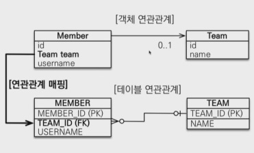
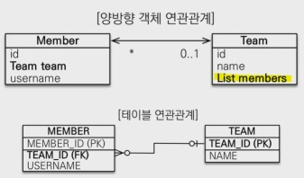

# JPA(Java Persistence API)

- JDBC → MyBatis, JdbcTemplate → JPA
- Java 진영 ORM 기술 표준
  - Object-relational mapping(객체 관계 매핑)
- JPA 2.1 표준명세 구현한 3가지 구현체 : Hibernate, EclipseLink, DataNucleus
- 사용이유
  - SQL 중심 개발 → 객체 중심 개발
  - 생산성
  - 유지보수
  - 패러다임 불일치 해결
  - 성능
  - 데이터 접근 추상화와 벤더 독립성
  - 표준
- 성능 최적화 기능
  - 1차 캐시와 동일성(identity) 보장
    - 같은 트랜잭션 안에서는 같은 엔티티 반환 → 약간의 성능 향상
    - DB Isolation Level이 Read Commit이어도 애플리케이션에서 Repeatable Read 보장
  - 트랜잭션을 지원하는 쓰기 지연(Transactional write-behind)
    - 트랜잭션 커밋할 때 까지 INSERT SQL 모아서 JDBC BATCH SQL로 한 번에 SQL 전송
    - UPDATE, DELETE로 인한 로우(ROW)락 시간 최소화
    - 트랜잭션 커밋 시 UPDATE, DELETE SQL 실행하고 바로 커밋
  - 지연 로딩(Lazy Loading)
    - 지연 로딩 : 객체가 실제 사용될 때 로딩
    - 즉시 로딩 : JOIN SQL로 한 번에 연관된 객체까지 미리 조회

### JPA 구동방식
- EntityManagerFactory 는 하나만 생성해서 App 전체에서 공유
- EntityManager는 쓰레드 간 공유 X (사용하고 버림)
- JPA의 모든 데이터 변경은 트랜잭션 안에서 실행
- 조회
  - EntityManager.find() : 단순 조회
  - 객체 그래프 탐색(a.getB().getC())

### INSERT/UPDATE
```java
    @Entity
    @Table(name = "USER") // 테이블명 다를 때
    public class Member {

        @Id
        private Long id;

        @Column(name = "username") // 컬럼명 다를 때
        private String name;

    }
```
```java
    EntityManagerFactory emf = Persistence.createEntityManagerFactory("persistence.name");
    EntityManager em = emf.createEntityManager();
    EntityTransaction tx = em.getTransaction();

    tx.begin();

    try {
        // INSERT
        Member member = new Member();
        member.setId(1L);
        member.setName("test");
        em.persist();

        // UPDATE
        Member findMember = em.find(Member.class, 1L);
        findMember.setName("test");
        
        // DELETE
        Member findMember = em.find(Member.class, 1L);
        em.remove(findMember);
        em.persist();

        // SELECT(단순조회)
        Member findMember = em.find(Member.class, 1L);

        // SELECT(JPQL) - Member는 Table이 아닌 Object로
        List<Member> findMembers = 
                        em.createQuery("select m from Member as m", Member.class)
                        .getResultList();

        tx.commit();
    } catch (Exception e) {
        tx.rollback();
    } finally {
        em.close();
    }
    emf.close();
```

### JPQL
- SQL을 추상화 한 객체 지향 쿼리 언어
- JPA는 검색할 때 테이블이 아닌 엔티티 객체를 대상으로 검색
- 모든 DB 데이터를 객체로 변환해서 검색하는 것은 불가능 → 필요한 데이터만 DB에서 불러오려면 검색 조건 포함된 SQL 필요
- SQL과 유사한 문법, SELECT, FROM, WHERE, GROUP BY, HAVING, JOIN 지원
- SQL을 추상화해서 특정 데이터베이스 SQL에 의존 X

## 영속성 컨텍스트
- 엔티티를 영구 저장하는 환경
- EntityManager.persist(entity)
- EntityMaganer를 통해 영속성 컨텍스트에 접근

### 엔티티의 생명주기
```java
    // 비영속 (그냥 객체)
    Member member = new Member();
    member.setId(10L);
    member.setName("test");

    // 영속
    em.persist(member);

    // 준영속
    em.detach(member);

    // 삭제
    em.remove(member);

    // flush - 쿼리 실행
    tx.commit();
```

- **비영속(new/transient)**
  - 영속성 컨텍스트와 전혀 관계 없는 새로운 상태
- **영속(managed)**
  - 영속성 컨텍스트에 관리되는 상태
- **준영속(detached)**
  - 영속성 컨텍스트에 저장되었다가 분리된 상태(영속 → 준영속)
  - 영속성 컨텍스트가 제공하는 기능 사용 불가
  - ```em.detach(entity)```, ```em.clear()```,  ```em.close()```
- **삭제(removed)**
  - 삭제된 상태
- **플러시 (flush)**
  - 영속성 컨텍스트의 변경내용을 데이터베이스에 반영
  - 영속성 컨텍스트를 비우지 않음
  - 변경 감지 → 수정된 엔티티 쓰기 지연 SQL 저장소에 등록 → 데이터베이스에 전송
  - 영속성 컨텍스트를 플러시하는 방법
    - ```em.flush()``` : 직접 호출
    - 트랜잭션 커밋, JPQL 쿼리 실행 : 자동 호출

## Entity Mapping
- 객체 - 테이블 : ```@Entity```, ```@Table```
- 필드 - 컬럼 : ```@Column```
- 기본키 : ```@Id```
- 연관관계 : ```@ManyToOne```, ```@JoinColum```

### @Entity
- JPA가 관리하는 Entity
- 주의사항
  - 기본 생성자 필수(파라미터 없는 public, protected 생성자)
  - final 클래스, enum, interface, inner 클래스 사용 X
  - 저장할 필드에 final 사용 X
- 속성
  - ```@Entity(name = "entity")```
    - JPA에서 사용할 엔티티 이름 지정
    - 기본값 : 클래스 이름 그대로 사용
    - 같은 클래스 이름이 없으면 가급적 기본값 사용할 것
  - ```@Table(name = "TABLE_NAME")``` : 매핑할 테이블 이름
  - ```@Table(catalog = "CATALOG")``` : 데이터베이스 catalog 매핑
  - ```@Table(schema = "SCHEMA")``` : 데이터베이스 schema 매핑
  - ```@Table(uniqueConstraints = {@UniqueCpnstraint( name = "LOGIN_ID_UNIQUE", columnNames = {"LOGIN_ID"} )})``` : DDL 생성 시 유니크 제약 조건 생성

### 데이터베이스 스키마 자동 생성
- DDL을 애플리케이션 실행 시점에 자동 생성
- 테이블 중심 → 객체 중심
- 데이터베이스 방언 활용하여 데이터베이스에 맞는 적절한 DDL 생성
- 개발 장비에서만 사용 (운영 사용 X)
-  **hibernate.hbm2ddl.auto**
   -  create : 기존 테이블 삭제 후 다시 생성(DROP + CREATE)
   -  crate-drop : 종료 시점에 테이블 DROP 
   -  update : 변경분만 반영(운영DB 사용X) // 컬럼 추가 O 컬럼 삭제 X
   -  validate : 엔티티와 테이블이 정상 매핑되었는지만 확인(안맞으면 에러남)
   -  none(default) : 사용하지 않음
-  주의
   -  **운영 장비에서는 create, create-drop, update 사용 XX**
   -  개발 초기 : create / udpate
   -  테스트 서버 : update / validate
   -  스테이징, 운영 서버 : validate / none
  
### DDL 생성 기능
- 제약조건 추가
  - ```@Colum(name = "LOGIN_ID", unique = true, nullable = false, length = 10)```
    - name
    - unique
    - nullable
    - length
  - ```@Table(uniqueConstraints = {@UniqueCpnstraint( name = "LOGIN_ID_UNIQUE", columnNames = {"LOGIN_ID"} )})``` : DDL 생성 시 유니크 제약 조건 생성
    - uniqueConstraints
- JPA 실행 로직에는 영향 X

### 필드와 컬럼 매핑
- ```@Column``` : 컬럼 매핑
  - name : 필드와 매핑할 테이블의 컬럼 이름 (default : 객체의 필드 이름)
  - insertable, updatable : 등록, 변경 가능 여부 (TRUE)
  - nullable(DDL) : null 값 허용 여부 설정
  - unique(DDL) : 한 컬럼에 간단히 유니크 제약조건을 걸 때 사용
    - 이름을 랜덤으로 붙여서 잘 안씀. uniqueConstraints 사용.
  - columnDefinition(DDL) : 데이터베이스 컬럼 정보를 직접 줄 수 있음
    - ex) varchar(100) default 'EMPTY'
  - length(DDL) : 문자 길이 제약조건, String 타입에만 사용 (255)
  - precision, scale(DDL) : BigDecimal 타입에서 사용(BigInteger에서도 O)
    - precision : 소수점 포함 전체 자릿수
    - scale : 소수 자릿수
    - double, float 타입 적용 X
- ```@Enumerated(EnumType.STRING)``` : ENUM 타입 매핑. ***ORDINAL(ENUM 순서) 사용 X***
- ```@Temporal(TemporalType.DATE/TIME/TIMESTAMP)``` : Date 타입 매핑
  - Java8 이후 LocalDate, LocalDateTime 사용 시 생략 가능
- ```@Lob``` : CLOB(매핑하는 필드 타입이 문자일 때), BLOB(나머지) 매핑
- ```@Transient``` : 매핑 제외(데이터베이스 저장X, 조회X). 메모리 상에서만 임시로 값을 보관할 때.

### 기본키 매핑
- ```@Id``` : 직접 할당
- ```@GeneratedValue(strategy = GenerationType.AUTO/IDENTITY/SEQUENCE/TABLE)``` : 자동 생성
  - IDENTITY : DB에 위임, AUTO_INCREMENT
    - MYSQL, PostgreSQL, SQL Server에서 사용
    - ```em.persist()``` **시점에 즉시 INSERT SQL 실행하고 이후 ID 값 알 수 있음**
  - SEQUENCE : DB 시퀀스 오브젝트 사용, CREATE SEQUENCE 
    - ORACLE
    - ```@SequenceGenerator``` 필요
      - name : 식별자 생성기 이름(필수)
      - sequenceName : DB에 등록되어 있는 시퀀스 이름(default : hibernate_sequence)
      - initialValue : DDL 생성 시에만 사용 (default : 1)
      - allocationSize : 시퀀스 호출에 증가하는 수 ***(default : 50)***
      - catalog, schema : DB catalog, schema 이름
      ```java
      @Entity
      @SequenceGenerator(
          name = "TEST_SEQ_GENERATOR",
          sequenceName = "TEST_SEQ",
          initialValue = 1, allocationSize = 1)
      public class test {

        @Id
        @GeneratedValue(strategy = GenerationType.SEQUENCE, generator = "TEST_SEQ_GENERATOR")
        private Long id;
      }
      
      ```

### TABLE 전략
- 키 생성 전용 테이블로 데이터 베이스 시퀀스를 흉내내는 전략
- 장점 : 모든 데이터베이스에 적용 가능
- 단점 : 성능 떨어져서 잘 안씀

    ```java
      @Entity
      @TableGenerator(
          name = "TEST_SEQ_GENERATOR",
          table = "TEST_SEQUENCES",
          pkColumnValue = "TEST_SEQ", allocationSize = 1)
      public class test {

        @Id
        @GeneratedValue(strategy = GenerationType.SEQUENCE, generator = "TEST_SEQ_GENERATOR")
        private Long id;
      }
      
    ```
- ```@TableGenerator``` 속성
  - name : 식별자 생성기 이름
  - table : 키생성 테이블명
  - pkColumnName : 시퀀스 컬럼명
  - valueColumnNa : 시퀀스 값 컬럼명
  - pkColumnValue : 키로 사용할 값 이름
  - initialValue : 초기값, 마지막으로 생성된 값 기준
  - allocationSize : 시퀀스 한 번 호출에 증가하는 수(성능 최적화에 사용)
  - catalog, schema : 데이터베이스 catalog, schema 이름
  - uniqueConstraints(DDL) : 유니크 제약 조건 지정

### 권장 식별자 전략
- 기본키 제약 조건 : null 아님, 유일, **변하면 안됨**
- 미래까지 이 조건을 만족하는 자연키 찾기 어려움 → 대리키(대체키) 사용
- 권장 : Long + 대체키 + 키 생성 전략 사용

## 연관관계 매핑
### 단방향 연관관계

```java
  @Entity
  public class Member {

    @Id @GeneratedValue
    @Column(name = "MEMBER_ID")
    private Long id;

    @Column(name = "USERNAME")
    private String username;

    @ManyToOne                        // Member(N) : Team(1)
    @JoinColumn(name = "TEAM_ID")     // Join 걸 컬럼명
    private Team team;

    ...
  }
```
### 양방향 연관관계

```java
  @Entity
  public class Team {

    @Id @GeneratedValue
    @Column(name = "TEAM_ID")
    private Long id;

    private String name;

    @OneToMany(mappedBy = "team") // Member의 team과 매핑
    private List<Member> members = new ArrayList<>();

    ...
  }
```
#### 연관관계의 주인과 ***mappedBy***
- 객체와 테이블 간 연관관계를 맺는 차이에 대한 이해
  - 객체 연관관계 : 2개
    - 회원 → 팀 (단방향)
    - 팀 → 회원 (단방향)
  - 테이블 연관관계 : 1개
    - 회원 ↔ 팀 (FK)
- ***연관관계의 주인(Owner)***
  - 양방향 매핑 규칙
    - 객체의 두 관계 중 하나를 연관관계의 주인으로 지정
    - 연관관계의 주인만이 외래 키를 관리(등록, 수정) 
    - 주인이 아닌 쪽은 읽기만 가능
    - mappedBy 속성으로 주인 지정 (주인은 mappedBy 속성 지정 X)
      - 주인
        - ***외래키가 있는 곳(N)*** (수정 시 업데이트가 이루어져야 할 테이블)
#### 주의점
- 자주하는 실수
  - 연관관계 주인의 값을 입력하지 않음
  - 순수 객체 상태를 고려하여 양쪽에 값을 넣어주는게 맞음
  - 연관관계 편의 메소드 생성
    ```java
    public void changeTeam(Team team) {
      this.team = team;
      // 연관관계 주인의 값 넣을 때 주인이 아닌 쪽도 값을 같이 넣어주는 연관관계 편의 메소드
      team.getMembers().add(this); 
    }
    ```
    or (상황에 따라 최선이 다름)
    ```java
    public void addMember(Member member) {
      member.setTeam(this);
      members.add(member);
    }
    ```
  - 양방향 매핑시 무한 루프 조심
    - toString(), lombok, JSON 생성 라이브러리....

#### 정리
- 단방향 매핑으로 이미 연관관계 매핑 완료
- 양방향 매핑은 반대 방향으로 **조회(객체 그래프 탐색) 기능**을 추가하는 것
- JPQL에서 역방향으로 탐색할 일이 많음
- 단방향 매핑 잘 하고 양방향은 필요할 때 추가해도 됨(테이블 영향 X)
- 연관관계의 주인은 비즈니스 로직 기준이 아닌, **외래키의 위치를 기준으로 정해야 함**
